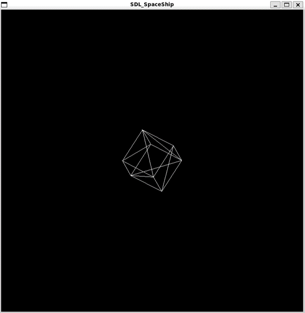

# SDL_Render

## Description
This is a program that renders using the SDL2 library to draw a 3D model in a window along with face triangulation using vectors and matrices via the GLM library. The model loads to a file in OBJ format which is displayed on the screen using the face triangulation technique.

This is the result of rendering a cube made in blender: 



And this is the result of rendering a Spaceship made in blender:


## Dependencies
- SLD2: Library used to create windows and render graphics.
- GLM: Mathematical Library for operations with vectors and matrices.

## Using Linux

First you need to install WSL, C++ with CMake, SDL and GLM

Then you need to run this command with the repository clone and in the folder Conway-sGameOfLife

```shell
./run.sh
```
